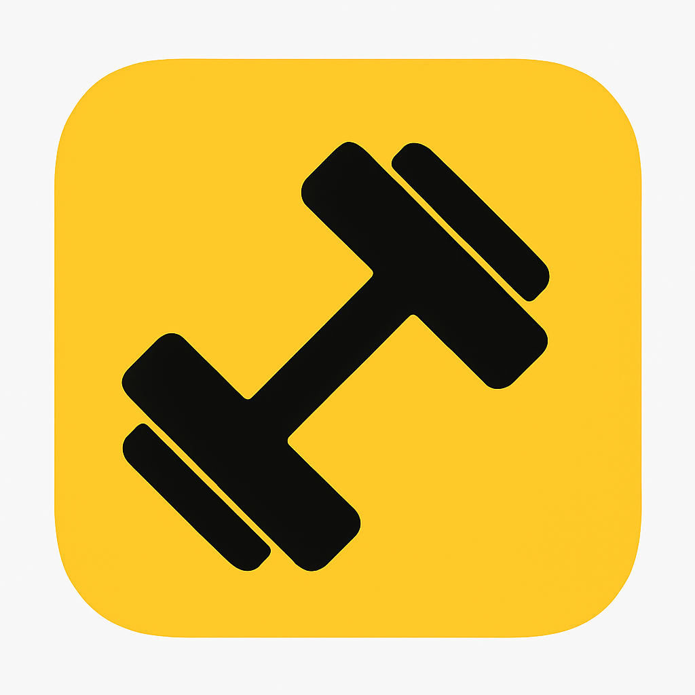

  

<h1 align="center">GymApp</h1>

  Planificá tus rutinas, organizá tus ejercicios y seguí tu progreso de entrenamiento desde una sola app.

## Tu entrenamiento, organizado

GymApp es una aplicación para llevar un registro personal de tus entrenamientos. Reúne tus rutinas, un catálogo de ejercicios y tu historial de progreso para que puedas consultar qué entrenar y cómo evolucionan tus registros con el tiempo.

## Rutinas a tu medida

- Creá, editá, consultá y eliminá rutinas personalizadas.
- Agregá ejercicios con sus series y repeticiones.
- Organizá el orden de los ejercicios arrastrándolos dentro de la rutina.
- Consultá cada rutina y los detalles de sus ejercicios desde la app.

## Tu catálogo de ejercicios

- Contá con un catálogo inicial de ejercicios.
- Creá ejercicios propios y editá sus nombres y descripciones.
- Eliminá los ejercicios que no necesites.
- Ordená el catálogo de forma personalizada, de A a Z o de Z a A.

## Registrá y visualizá tu progreso

Guardá el peso utilizado, las repeticiones y si llegaste al fallo en cada registro. Elegí un ejercicio para consultar su evolución en el gráfico y revisar el detalle en la lista de abajo.

El selector integrado al gráfico permite elegir:

- **All:** todo el historial.
- **1A:** el último año.
- **6M:** los últimos seis meses.
- **2M:** los últimos dos meses.
- **1M:** el último mes.
- **Calendario:** un rango personalizado entre dos fechas, incluyendo ambos días completos.

El gráfico y la lista siempre muestran los registros del mismo período. Cambiar el filtro no elimina datos: solo cambia qué parte del historial estás viendo.

La barra de selección es compacta y redondeada, con colores translúcidos y un indicador amarillo que se desliza entre las opciones.

## Una experiencia simple y personal

La interfaz mantiene una identidad visual en amarillo y tonos neutros, con tema claro y oscuro. Tu preferencia de tema se conserva entre sesiones.

En la pantalla de progreso, el encabezado respeta el espacio de la barra de estado del teléfono para mantener accesibles sus controles.

## Tus datos, en tu dispositivo

Las rutinas, los ejercicios, los registros y la preferencia de tema se guardan localmente. La gestión del entrenamiento no depende de un backend.

El almacenamiento es local, no una copia de seguridad en la nube: borrar los datos de la aplicación o desinstalarla puede eliminar tus registros.

---

Hecho para llevar un registro simple, visual y personal del entrenamiento. 💪
